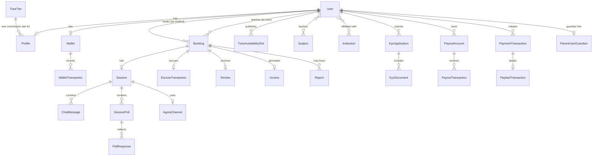

# Domain Model

This is the canonical, general-purpose reference for the data model.
[`docs/flutter-app-prompt.md` §2](flutter-app-prompt.md#2-domain-model-what-youre-working-with)
has a mobile-framed condensed version of the same model — treat this
document as the source of truth, not that one.

## Entity groups

### Identity

- **User** — role: `student` | `tutor` | `admin`; account_status: `active` |
  `suspended` | `banned` | `pending_kyc`.
- **Profile** — one-to-one with User; tutor-only metadata (hourly rate, bio,
  specializations, education level, years of experience, cached rating/
  review/session stats, KYC status, tier).
- **ParentUserGuardian** — links a minor student account to a guardian.
- **AuditLog** — append-only record of sensitive state changes (auth events,
  payout state transitions, KYC decisions, etc.).

### Tutoring

- **TutorAvailabilitySlot** — a tutor's weekly recurring availability window.
- **TutorTier** — commission rate by session-count threshold; drives the
  tutor's "net to tutor" calculation.
- **Subject**, **Institution** — reference/lookup data, linked to tutors via
  pivot tables (`profile_subjects`, `profile_institutions`).

### Booking / Session

- **Booking** — student + tutor + subject + scheduled time; snapshots
  hourly rate and platform fee at creation time so later rate/tier changes
  don't retroactively affect an existing booking's price.
- **Session** — the live 1:1 video session tied to an accepted booking.
- **SessionPoll**, **PollResponse** — in-session live polls and responses.
- **ChatMessage** — in-session chat, broadcast over the session's private
  channel.
- **AgoraChannel** — Agora channel/token bookkeeping for a session.
- **Review** — student's rating/feedback for a completed booking.
- **Report** — a conduct report filed against a session, optionally
  force-ending it.

### Money

- **Wallet** — one per user: `balance` (spendable) + `escrow_balance` (held).
- **WalletTransaction** — immutable ledger row for every wallet mutation
  (`balance_before`/`balance_after`, type, direction, reference, metadata).
- **EscrowTransaction** — one-to-one with a booking once accepted; holds
  funds until the session completes or is refunded/disputed.

### Payments

- **PaymentTransaction** — gateway-agnostic payment record.
- **PaymentGatewayConfiguration** — DB-stored, encrypted gateway credentials,
  keyed by environment (sandbox/production).
- **PaymentMethod** — a gateway's active/inactive registration.
- **UserPaymentMethodPreference** — a user's preferred payment method.
- **PayfastTransaction** — PayFast-specific transaction detail.
- **StripeTransaction** — present in the schema, but **not** wired to a live
  gateway path (no active `PaymentGatewayInterface` driver uses it today).
- **Invoice** — generated PDF invoice for a completed, paid booking.

### Payouts

- **PayoutAccount** — a tutor's withdrawal destination; account number
  stored encrypted; one default per user; must be admin-verified.
- **PayoutTransaction** — a withdrawal request and its lifecycle.

### KYC

- **KycApplication** — a tutor's identity-verification application.
- **KycDocument** — supporting documents (ID, selfie, proof of
  qualification/address) attached to an application.

### Platform

- **PlatformSetting** — tunable business rules (commission defaults, minimum
  payout, cancellation penalties, etc.).
- **NotificationPreference** — a user's per-channel notification opt-in/out.

## Entity relationships

## Status / lifecycle enums

| Entity | States |
|---|---|
| Booking | `pending` → `accepted`\|`declined` → `in_progress` → `completed`\|`cancelled`\|`disputed`\|`refunded` |
| Session | `waiting` → `active` → `in_progress` → `ended`\|`abandoned`\|`disputed` |
| EscrowTransaction | `Held` → `Released`\|`Refunded`\|`Disputed` |
| KycApplication | `pending` → `under_review` → `approved`\|`rejected`\|`resubmitted` |
| PayoutTransaction | `pending` → `processing` → `completed`\|`failed` |

---

See [`docs/MONEY_FLOW.md`](MONEY_FLOW.md) for how the money-related entities
actually move, and
[`docs/flutter-app-prompt.md` §2](flutter-app-prompt.md#2-domain-model-what-youre-working-with)
for the mobile-framed summary.
